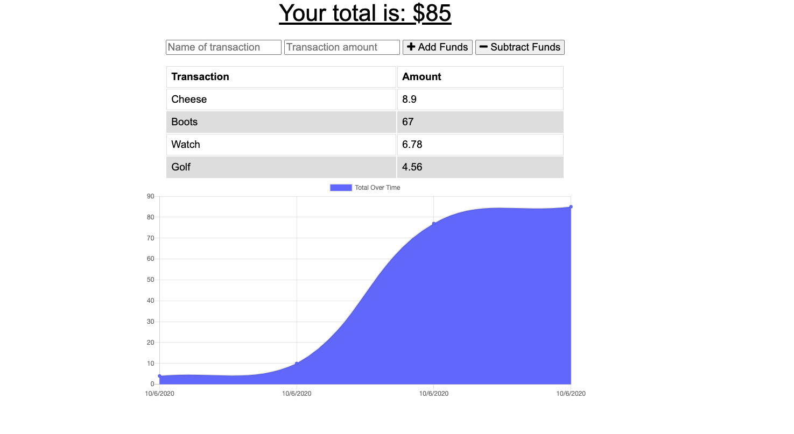

# pwa-budget-tracker

<h2> PWA Budget Tracker </h2> 

<h2> Author </h2>

Kendall Masterson

https://github.com/mastersonkl

masterson.kendall@gmail.com

<h2> Description </h2>

This is a budget tracker that allows the user to track their budget by entering each purchase made by subtracting funds and adding money to their account by adding funds. The top of the screen automatically shows the total of the funds you have entered. The application is set up with a service worker and a web manifest to make it a fully functional PWA.

**## Table of Contents**

- [Installation Instructions](#installation-instructions)
- [Usage Information](#usage-information)

## Installation Instructions

You can install this program by cloning it to your local machine by running `git clone`. Run `npm i` to install the dependencies included in the package.json. After installing the program, run it in your terminal using node `node server.js`.

## Usage Information

This is a simple and user friendly budgeting app. After adding a deposit or transaction the graph will update to show you your budget across time. This app will work on and offline! This application is deployed on Heroku and can be found here: https://pwa-budget-ap.herokuapp.com/ 

